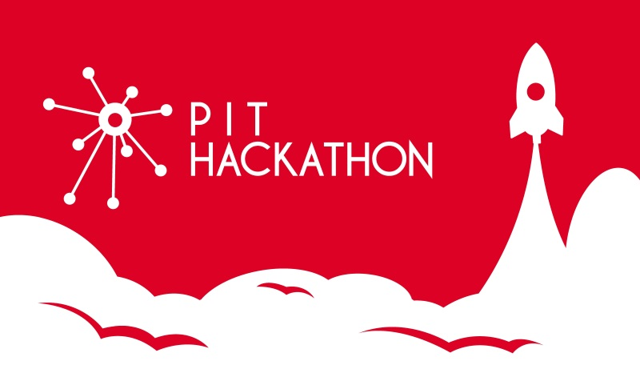

# PIT-Hackathon 2017 WebGame Babylon.js ES2017 Template
 Die ist das Babylon.js Web Game Template.

 Ihr könnt das "Spiel" auch online ausprobieren.[https://pit-hackathon.github.io/2017-WebGame-Babylon-ES2017/](https://pit-hackathon.github.io/2017-WebGame-Babylon-ES2017/)



# Anforderungen
Ihr benötigt [Node.js](https://nodejs.org/en/) um das Spiel zu kompilieren und zu starten.

# Getting started

## 1. Dieses Repository klonen oder Zip herunterladen
Ihr könnt mit ```git clone``` dieses Repository klonen oder hier im auf Github ein Archiv mit alle Dateien herunterladen.

## 2. NPM Pakete installieren
Mit ```npm install``` werden alle notwendigen Pakete aus dem NPM Repository geladen und installiert.

## 3. Spiel starten / testen
Das Spiel könnt ihr anschließend mit ```npm start``` ausführen. Dabei wird gleichzeitig ein Webpack-Dev-Server gestartet. Dieser überwacht den Quellecode und kompiliert bei Änderungen das Spiel erneut.

## 4. Spiel verpacken für das Deployment
Mit ```npm run deploy``` könnt ihr den Code und alle abhängigkeiten in eine Javascript Datei verpacken und anschließend verteilen.